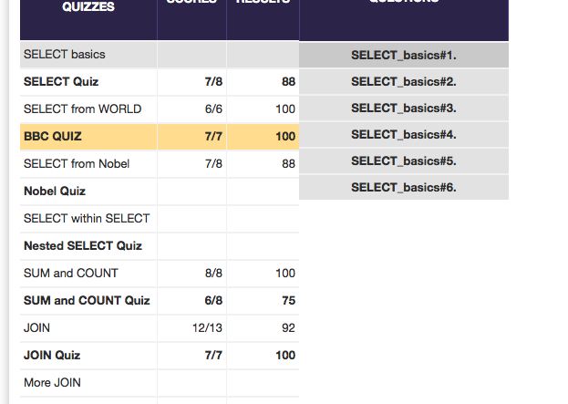

## U3.W7: SQLZoo

####I worked on this challenge [by myself, with: ].

### My Quiz Results:

### Reflection
These exercises seemed easy, but in later exercises, when applying them in a more thorough coding context it got to be a bit more of a challenge. This was great practice at knowing the right syntax, but also at learning how best to think of databases, joins, foreign keys, etc...