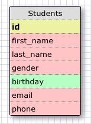
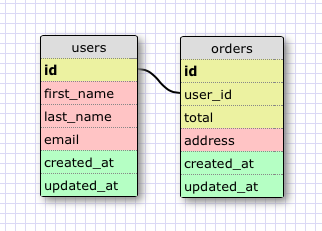
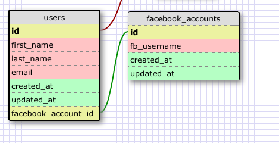
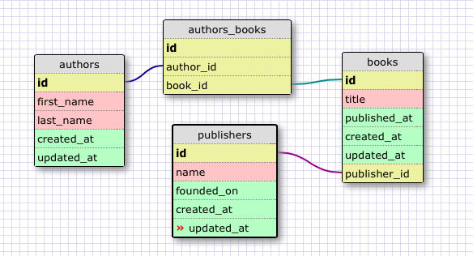
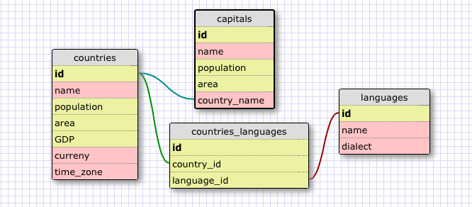

# U3.W7: Designing Schemas

#### I worked on this challenge [by myself, with: ]

## Release 0: Student Roster Schema

## Release 1: One to Many Schema

## Release 2: One to One Schema

## Release 3: Many to Many Schema

## Release 4: Design your own Schema
Description of what you're modeling: 

I've always dreamt of having a flashcard set for the countries of the world, to help me memorize and stay up to date with them. You know- buff up on my geography.

Here we have a one-to-one schema for the countries of the world, and their capital cities, and a many-to-many model for countries and languages. One language can be spoken by many countries, and one country might speak many languages.

## Release 5: Reflection

I am still having a little bit of trouble visualizing how the join table will work in the many to many relationship, but I think I get it.bthe join table literally joins the two tables. In my understanding right now, the join table does contain unique information- the relationship between countries and the languages they speak. There might be many different country id's associated with the same language id, or many different language ids associated with the same country, within this table. 

I think part of the reason it's harder to conceptualize is because each individual row is not as clearly a seperate object as in other simpler instances. Each country is its own country and that can only happen once, but each of the foreign keys can happen multiple times in the join table. The only thing making the rows individual is the synthetic key. and that's synthetic.
