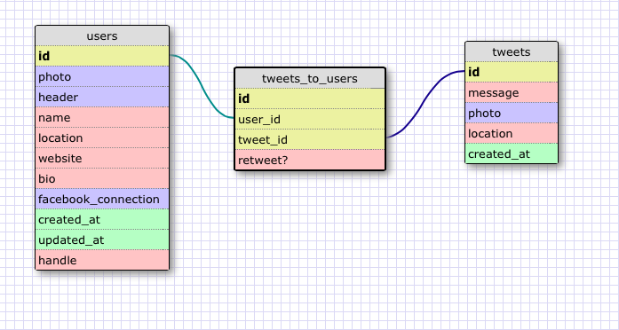

# U3.W7: Modeling a Real-World Database (SOLO CHALLENGE)

## Release 0: Users Fields
Photo, Header, Name, Location, Website, Bio, Facebook Connection
## Release 1: Tweet Fields
text/message, photo, location

## Release 2: Explain the relationship
The relationship between `users` and `tweets` is: many to many because one user can create many tweets, and one tweet could be posted(retweeted) by many different users.

## Release 3: Schema Design

## Release 4: SQL Statements
all tweets for a certain user id:
     
    SELECT message from tweets_to_users JOIN tweets ON tweet_id = id
    WHERE user_id = 112

Tweets for a certain ID that were made after last Wednesday:

    SELECT message from tweets_to_users JOIN tweets ON tweet_id = id
    WHERE (user_id = 112 AND created_at >= 2014-5-16 00:00:00``

All the tweets associated with a given user's twitter handle:

    SELECT message FROM tweets 
    JOIN tweets_to_users ON tweet_id = tweets.id 
    JOIN users ON user_id = users.id
    WHERE handle = celeenr
    

the twitter handle associated with a given tweet ID

    SELECT handle FROM  tweets_to_users
    JOIN users ON user_id = users.id
    WHERE tweet_id = 5112

## Release 5: Reflection
After having JOINed over three tables, I'm beginning to more clearly understand the many-to-many relationship. that is, assuming that my SQL statements are actually correct!